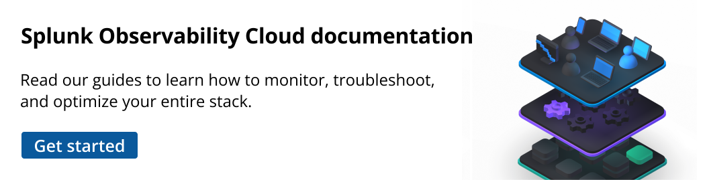

.. _docs-home-page:

**********
Welcome
**********

.. role:: icon-cloud-upload
.. rst-class:: newparawithicon

:icon-cloud-upload:`.` :strong:`Get your data in`
The first step toward observability is getting relevant data into Splunk Observability Cloud. View :ref:`all supported integrations <supported-data-sources>`.

.. rst-class:: newcard

:strong:`Get data in`
Learn how to get data in from each layer in your stack :ref:`get-started-get-data-in`

.. rst-class:: newcard

:strong:`OpenTelemetry`
Install the Splunk Distribution of the OpenTelemetry Collector :ref:`otel-intro`

.. rst-class:: newcard

:strong:`Cloud providers`
Integrate to collect service metrics and logs :ref:`get-started-connect`

.. rst-class:: newcard

:strong:`Back-end apps and services`
Instrument to collect traces and logs :ref:`get-started-application`

.. rst-class:: newcard

:strong:`Front-end app user experiences`
Instrument to collect user sessions :ref:`rum-gdi`

.. rst-class:: newcard

:strong:`Serverless functions`
Instrument to collect traces and logs :ref:`instrument-serverless-functions`

.. role:: icon-display
.. rst-class:: newparawithicon

:icon-display:`.` :strong:`Explore and monitor your environment`
After you have data coming into Splunk Observability Cloud, you can do some exploring.

.. rst-class:: newcard

:strong:`Infrastructure Monitoring`
Monitor server and cluster metrics :ref:`wcidw-imm`

.. rst-class:: newcard

:strong:`Application Performance Monitoring`
Monitor back-end app and service traces :ref:`wcidw-apm`

.. rst-class:: newcard

:strong:`Real User Monitoring`
Monitor data about front-end app user experiences :ref:`wcidw-rum`

.. rst-class:: newcard

:strong:`Log Observer Connect`
Query logs to identify root causes :ref:`logs-intro-logconnect`

.. rst-class:: newcard

:strong:`Synthetic Monitoring`
Proactively monitor the performance of web resources :ref:`welcome-synthmon`

.. rst-class:: newcard

:strong:`All products`
Learn more about all Splunk Observability Cloud products :ref:`welcome`

.. role:: icon-wrench
.. rst-class:: newparawithicon

:icon-wrench:`.` :strong:`Set up alerts and customize your account`
Prepare for issues that might arise by setting up alerts, custom dashboards, and other advanced features.

.. rst-class:: newcard

:strong:`Detectors and alerts`
Receive alerts about conditions you care about :ref:`create-detectors`

.. rst-class:: newcard

:strong:`Dashboards and charts`
Get actionable insights about the systems you monitor :ref:`dashboards`

.. rst-class:: newcard

:strong:`Span tags`
Use span tags to add useful metadata to traces :ref:`apm-add-context-trace-span`

.. rst-class:: newcard

:strong:`Logs pipeline`
Add value to your raw logs by customizing your pipeline :ref:`logs-pipeline`

.. rst-class:: newcard

:strong:`Related Content`
Enable users to seamlessly move across product views :ref:`get-started-relatedcontent`

.. rst-class:: newcard

:strong:`Global Data Links`
Provide convenient access to relevant resources :ref:`link-metadata-to-content`

.. role:: icon-cogs
.. rst-class:: newparawithicon

:icon-cogs:`.` :strong:`Administer your account`
As a Splunk Observability Cloud administrator, use these tools to give your users a secure and relevant user experience.

.. rst-class:: newcard

:strong:`Get started`
Learn how to set up and administer your organization :ref:`admin-admin`

.. rst-class:: newcard

:strong:`Access tokens`
Authenticate and track API use :ref:`admin-org-tokens`

.. rst-class:: newcard

:strong:`Users`
Invite users and set access levels :ref:`admin-manage-users`

.. rst-class:: newcard

:strong:`Teams`
Create teams to help coordinate teamwork :ref:`admin-manage-teams`

.. rst-class:: newcard

:strong:`Single sign-on`
Set up an integration to an SSO provider :ref:`sso-label`

.. rst-class:: newcard

:strong:`Subscription usage`
Monitor subscription usage for Infrastructure Monitoring :ref:`subscription-overview`

.. role:: icon-cloud-upload
.. rst-class:: newparawithicon

:icon-cloud-upload:`.` :strong:`Popular integrations`
Access documentation for some of the most popular integrations used to get data into Splunk Observability Cloud.

.. rst-class:: newcard

:strong:`Linux`
Collect metrics and logs :ref:`get-started-linux`

.. rst-class:: newcard

:strong:`Kubernetes`
Collect metrics and logs :ref:`get-started-k8s`

.. rst-class:: newcard

:strong:`Windows`
Collect metrics and logs :ref:`get-started-windows`

.. rst-class:: newcard

:strong:`Amazon Web Services`
Collect metrics and logs :ref:`get-started-aws`

.. rst-class:: newcard

:strong:`Azure`
Collect metrics :ref:`get-started-azure`

.. rst-class:: newcard

:strong:`Browser`
Collect user sessions :ref:`browser-rum-gdi`

.. rst-class:: newcard

:strong:`.NET`
Collect traces :ref:`get-started-dotnet`

.. rst-class:: newcard

:strong:`Java`
Collect traces :ref:`get-started-java`

.. rst-class:: newcard

:strong:`Ruby`
Collect traces :ref:`get-started-ruby`

.. rst-class:: newcard

:strong:`Node.js`
Collect traces :ref:`get-started-nodejs`

.. rst-class:: newcard

:strong:`PHP`
Collect traces :ref:`get-started-php`

.. rst-class:: newcard

:strong:`All supported integrations`
View a list of all supported integrations :ref:`supported-data-sources`

.. ----- This comment separates the landing page from the TOC -----

.. toctree::
   :caption: Get started
   :maxdepth:   2

   get-started/welcome

.. toctree::
   :maxdepth:   3

   Get started <get-started/o11y>

.. toctree::
   :maxdepth:   3

   Scenarios <get-started/scenario-landing>

.. toctree::
   :maxdepth:   3

   About Mobile TOGGLE <get-started/intro-to-mobile>

.. toctree::
   :maxdepth:   3

   Contribute to our documentation <get-started/contribute>

.. toctree::
   :maxdepth:   3

   Support <get-started/support>

.. toctree::
   :caption: Splunk platform users
   :maxdepth:   3

   Splunk Observability Cloud and the Splunk platform <splunkplatform/splunkplatform-landing>

.. toctree::
   :maxdepth:   3

   Unified Identity <splunkplatform/unified-id/unified-identity>

.. toctree::
   :maxdepth:   3

   Measure and alert on your SLIs <splunkplatform/practice-reliability/slis>

.. toctree::
   :maxdepth:   3

   Respond to incidents <splunkplatform/practice-reliability/incident-response>

.. toctree::
   :maxdepth:   3

   Collaborate on observability <splunkplatform/practice-reliability/collaboration>

.. toctree::
   :caption: Administer Splunk Observability Cloud
   :maxdepth:   3

   admin/admin

.. toctree::
   :maxdepth:   3

   Authentication and Security TOGGLE <admin/authentication/authentication-intro>

.. toctree::
   :maxdepth:   3

   User and team management TOGGLE <admin/user-management/user-management-intro>

.. toctree::
   :hidden:
   :maxdepth:   3

   Send alert notifications to third-party services TOGGLE <admin/notif-services/admin-notifs-index>

.. toctree::
   :maxdepth:   3

   View organization metrics <admin/org-metrics>

.. toctree::
   :maxdepth:   3

   Monitor subscription usage and billing TOGGLE <admin/subscription-usage/subscription-usage-overview>

.. toctree::
   :maxdepth:   3

   Org reference info TOGGLE <admin/references/org-info>

.. toctree::
   :caption: Get your data in
   :maxdepth:   3

   gdi/get-data-in/get-data-in

.. toctree::
   :maxdepth:   3

   gdi/get-data-in/integrations

.. toctree::
   :maxdepth:   3

   Connect to your cloud service provider TOGGLE <gdi/get-data-in/connect/connect>

.. toctree::
   :maxdepth:   3

   Collect infrastructure metrics and logs TOGGLE <gdi/get-data-in/compute/compute>

.. toctree::
   :maxdepth:   4

   Instrument back-end services TOGGLE <gdi/get-data-in/application/application>

.. toctree::
   :maxdepth:   3

   Instrument serverless functions TOGGLE <gdi/get-data-in/serverless/instrument-serverless-functions>

.. toctree::
   :maxdepth:  3

   Instrument front-end applications TOGGLE <gdi/get-data-in/rum/rum-instrumentation>

.. toctree::
   :maxdepth:   3

   Available host and application monitors TOGGLE <gdi/index>

.. toctree::
   :maxdepth: 4

   Splunk Distribution of OpenTelemetry Collector TOGGLE <gdi/opentelemetry/opentelemetry>

.. toctree::
   :maxdepth: 3

   gdi/other-ingestion-methods/other-data-ingestion-methods

.. toctree::
   :maxdepth: 3

   SignalFx Smart Agent (Deprecated) TOGGLE <gdi/smart-agent/smart-agent-intro>

.. toctree::
   :caption: Understand and analyze your data
   :maxdepth:   3

   metrics-and-metadata/data-model

.. toctree::
   :maxdepth:   3

   Metrics, metadata and events TOGGLE <metrics-and-metadata/metrics-landing>

.. toctree::
   :maxdepth:   3

   Data tools TOGGLE <metrics-and-metadata/data-tools-landing>

.. toctree::
   :maxdepth:   3

   SignalFlow and analytics TOGGLE <analytics/signalflow-analytics-intro>

.. toctree::
   :caption: Dashboards and charts
   :maxdepth:   3

   Dashboards TOGGLE <data-visualization/dashboards/dashboards>

.. toctree::
   :maxdepth:   3

   Charts TOGGLE <data-visualization/charts/charts>

.. toctree::
   :maxdepth:   3

   Navigate with data links <data-visualization/navigate-with-data-links>   

.. toctree::
   :maxdepth:   3

   Override default time range <data-visualization/use-time-range-selector>   

.. toctree::
   :maxdepth:   3

   Read and write permissions <data-visualization/permissions>

.. toctree::
   :caption: Alerts and detectors
   :maxdepth:   3

   Introduction to alerts and detectors <alerts-detectors-notifications/alerts-detectors-notifications>

.. toctree::
   :maxdepth:   3

   Alerts and detectors scenario library TOGGLE <alerts-detectors-notifications/scenarios-detectors-alerts/scenarios-intro>

.. toctree::
   :maxdepth:   3

   Use and customize AutoDetect alerts and detectors TOGGLE <alerts-detectors-notifications/autodetect/autodetect>

.. toctree::
   :maxdepth:   3

   Create detectors to trigger alerts <alerts-detectors-notifications/create-detectors-for-alerts>

.. toctree::
   :maxdepth:   3

   alerts-detectors-notifications/detector-manage-permissions

.. toctree::
   :maxdepth:   3

   Link detectors to charts <alerts-detectors-notifications/link-detectors-to-charts>

.. toctree::
   :maxdepth:   3

   Manage notification subscribers <alerts-detectors-notifications/manage-notifications>

.. toctree::
   :maxdepth:   3

   Preview detector alerts <alerts-detectors-notifications/preview-detector-alerts>

.. toctree::
   :maxdepth:   3

   View alerts <alerts-detectors-notifications/view-alerts>

.. toctree::
   :maxdepth:   3

   View detectors <alerts-detectors-notifications/view-detectors>

.. toctree::
   :maxdepth:  3

   Mute alert notifications <alerts-detectors-notifications/mute-notifications>

.. toctree::
   :maxdepth:   3

   Auto-clear alerts <alerts-detectors-notifications/auto-clearing-alerts>

.. toctree::
   :maxdepth:   3

   Troubleshoot detectors <alerts-detectors-notifications/troubleshoot-detectors>

.. toctree::
   :maxdepth:   3

   Detector options <alerts-detectors-notifications/detector-options>

.. toctree::
   :maxdepth:   3

   Built-in alert conditions TOGGLE <alerts-detectors-notifications/alert-condition-reference/index>

.. toctree::
   :maxdepth:   3

.. toctree::
   :caption: Application Performance Monitoring
   :maxdepth:   3

   apm/intro-to-apm

.. toctree::
   :maxdepth:   3

   apm/key-concepts

.. toctree::
   :maxdepth:   3

   Scenarios for troubleshooting errors and monitoring application performance using Splunk APM TOGGLE <apm/apm-scenarios/apm-scenarios-intro>

.. toctree::
   :maxdepth:   3

   Set up Splunk APM TOGGLE <apm/set-up-apm/apm>

.. toctree::
   :maxdepth:   3

   Manage services, spans, and traces in Splunk APM TOGGLE <apm/apm-spans-traces/traces-spans>

.. toctree::
   :maxdepth:   3

   Analyze services with span tags and MetricSets TOGGLE <apm/span-tags/span-tags>

.. toctree::
   :maxdepth:   3

   Correlate traces to track Business Workflows TOGGLE <apm/workflows/workflows>

.. toctree::
   :maxdepth:   3

   Visualize and alert on your application in Splunk APM TOGGLE <apm/apm-alert-visualize/alert-visualize>

.. toctree::
   :maxdepth:   3

   AlwaysOn Profiling TOGGLE <apm/profiling/intro-profiling>

.. toctree::
   :maxdepth:   3

   Monitor Database Query Performance TOGGLE <apm/db-query-perf/db-query-performance>

.. toctree::
   :maxdepth:   3

   Use Data Links to connect APM properties to relevant resources TOGGLE <apm/apm-data-links/data-links-landing>

.. toctree::
   :caption: Infrastructure
   :maxdepth:   3

   Introduction <infrastructure/intro-to-infrastructure>

.. toctree::
   :maxdepth:   3

   Key concepts <infrastructure/terms-concepts>

.. toctree::
   :maxdepth:   2

   Quick start tutorial <infrastructure/quickstart-imm>

.. toctree::
   :maxdepth:   3

   infrastructure/infrastructure

.. toctree::
   :maxdepth:   3

   Monitor services and hosts <infrastructure/monitor/monitor-services-hosts>

.. toctree::
   :maxdepth:   3

   Use navigators <infrastructure/use-navigators>

.. toctree::
   :maxdepth:   3

   Metrics pipeline management TOGGLE <infrastructure/metrics-pipeline/metrics-pipeline>

.. toctree::
   :maxdepth:   3

   Network Explorer TOGGLE <infrastructure/network-explorer/network-explorer>

.. toctree::
   :maxdepth:   3

   Virtual metrics <infrastructure/virtual-metrics>

.. toctree::
   :maxdepth:   3

   Resolution and data retention <infrastructure/retention>

.. toctree::
   :maxdepth:   3

   Resolution and data retention (DPM) <infrastructure/dpm-retention>

.. toctree::
   :caption: Log Observer
   :maxdepth:   3

   Splunk Log Observer Connect TOGGLE <logs/lo-connect-landing> 

.. toctree::
   :maxdepth:   3   

   Splunk Log Observer TOGGLE <logs/log-observer-landing>

.. toctree::
   :caption: Real User Monitoring
   :maxdepth:   3

   rum/intro-to-rum

.. toctree::
   :maxdepth:   3

   rum/rum-terminology-concepts

.. toctree::
   :maxdepth:   3

   Splunk RUM scenario library TOGGLE <rum/rum-scenario-library/scenario-landingpage>

.. toctree::
   :maxdepth:   3

   Set up Splunk RUM <rum/set-up-rum>

.. toctree::
   :maxdepth:   3

   rum/sensitive-data-rum

.. toctree::
   :maxdepth:   3

   rum/data-collected

.. toctree::
   :maxdepth:   3

   rum/RUM-custom-events

.. toctree::
   :maxdepth:   3

   rum/error-aggregates

.. toctree::
   :maxdepth:   3

   rum/rum-tag-search

.. toctree::
   :maxdepth:   3

   rum/rum-rules

.. toctree::
   :maxdepth:   3

   rum/rum-alerts

.. toctree::
   :maxdepth:   3

   Splunk RUM dashboards TOGGLE <rum/rum-dashboards/rum-dashboards>

.. toctree::
   :maxdepth:   3

   rum/RUM-metrics

.. toctree::
   :maxdepth:   3

   rum/sample-app

.. toctree::
   :maxdepth:   3

   rum/rum-third-party-software

.. toctree::
   :caption: Synthetics
   :maxdepth:   3

   synthetics/intro-synthetics

.. toctree::
   :maxdepth:   3

   synthetics/key-concepts

.. toctree::
   :maxdepth:   3 
  
   Synthetics scenario library TOGGLE <synthetics/synth-scenarios/synth-landing>

.. toctree::
   :maxdepth:   3

   synthetics/set-up-synthetics/set-up-synthetics

.. toctree::
   :maxdepth:   3

   Use a browser test to test a webpage TOGGLE <synthetics/browser-test/browser-test>

.. toctree::
   :maxdepth:   3

   Use an Uptime Test to test port or HTTP uptime TOGGLE <synthetics/uptime-test/uptime-test>

.. toctree::
   :maxdepth:   3

   Use an API Test to test an endpoint TOGGLE <synthetics/api-test/api-test>

.. toctree::
   :maxdepth:   3

   Configure your tests TOGGLE <synthetics/test-config/test-config>

.. toctree::
   :caption: Incident Intelligence
   :maxdepth:   3

   Introduction to Splunk Incident Intelligence <incident-intelligence/intro-to-incident-intelligence>

.. toctree::
   :maxdepth:   3

   incident-intelligence/incident-intelligence-overview

.. toctree::
   :maxdepth:   3

   incident-intelligence/key-concepts

.. toctree::
   :maxdepth:   3

   Set up Incident Intelligence <incident-intelligence/set-up-incident-intelligence>

.. toctree::
   :maxdepth:   3

   Ingest alerts in Incident Intelligence TOGGLE <incident-intelligence/ingest-alerts/ingest-alerts>

.. toctree::
   :maxdepth:   3

   incident-intelligence/create-configure-incident-policies

.. toctree::
   :maxdepth:   4

   Create and manage on-call schedules TOGGLE <incident-intelligence/create-manage-on-call-schedules/create-manage-on-call-schedules>

.. toctree::
   :maxdepth:   3

   Respond to and manage incidents TOGGLE <incident-intelligence/respond-manage-incidents/respond-manage-incidents>

.. toctree::
   :maxdepth:   3

   Manage notifications from Incident Intelligence TOGGLE <incident-intelligence/manage-notifications/manage-notifications.rst>

.. toctree::
   :caption: Reference and Legal
   :maxdepth:   3

   Third-party software credits </references/third-party-credits>
   
.. toctree::
   :maxdepth:   3

   Glossary <references/glossary>

